# 목차

## 기억하고 싶은 알고리즘    
### 1. 재귀 제한 해제

    import sys    
    sys.setrecursionlimit(2600)

&nbsp;예시 : [1012](https://www.acmicpc.net/problem/1012)

### 2. 2차원 배열 초기화
  
    ground =  [[0] * M for _ in range(N)]

&nbsp;예시 : [1012](https://www.acmicpc.net/problem/1012)

### 3. DFS
예시 : [1012](https://www.acmicpc.net/problem/1012)
[2667](https://www.acmicpc.net/problem/1012)

### 4. BFS
예시 : [2178](https://www.acmicpc.net/problem/2178)    

### 5. 공백없는 문자열 한글자씩 리스트에 나누어 입력 받기
        1. my_list = list(map(int, input()))    
        
        2. maze = [list(map(int, input())) for _ in range(N)]
        
예시 : [2667](https://www.acmicpc.net/problem/2667)
[2178](https://www.acmicpc.net/problem/2178) 

### 6. 한 줄에 여러 개의 변수 입력 받기
        1. M, N, K = [int(x) for x in input().split(' ')]
        
        2. M, N, K = map(int, input().split(' '))    
        
설명 : 공백 문자를 기준으로 각각 M, N, K 변수에 대입     
( 3 8 92 식으로 입력된다고 가정하면 M == 3, N == 8, K == 92 가 된다. )    
예시 : [1012](https://www.acmicpc.net/problem/1012)

### 7. 큐 생성
        from collections import deque
        queue = deque()
설명 : collections 라이브러리에 deque 함수를 사용한다.    
참조 : [블로그 1](https://ooeunz.tistory.com/31)

### 8. empty list check ( 빈 리스트 확인 )
        if my_list:
            print("해당 리스트는 비어있지 않습니다.")
        else: # (if not my_list)
            print("해당 리스트는 비어있습니다.")
설명 : 빈 sequence(스트링이나 리스트, 튜플)는 false값을 가진다.    

### 9. if condition one-liner
    if x > 0:
        print("x > 0 입니다.")
    else:
        print("x <= 0 입니다.")

    print("x > 0 입니다.") if x > 0 else print("x <= 0 입니다.")
설명 : 위의 if-else 문과 아래 if-else 문은 동일한 기능을 한다.  

### 10. isalpha, isdigit, isalnum
    my_string.isalpha()
    
    my_string.isdigit()
    
    my_string.isalnum()
설명 : 해당 스트링이 각각 알파벳인지, 숫자인지, 알파벳 or 숫자 인지 판단하여 True, False 를 return 한다.

### 11. zip - 여러 리스트를 for 문에 함께 사용하기
    list1 = [1, 2, 3]
    list2 = [4, 5, 6]

    for x, y in zip(list1, list2):
        print(x, y)

### 12. 정규표현식
    from re import sub

    def solution(new_id):
        new_id = new_id.lower()
        new_id = sub("[^a-z0-9-_.]", "", new_id)
        new_id = sub("\.+", ".", new_id)
        new_id = sub("(^\.|\.$)", "", new_id)
        new_id = new_id if new_id else "a"
        new_id = sub("\.$", "", new_id[:15])
        new_id = new_id if len(new_id) > 3 else new_id + new_id[-1] * (3 - len(new_id))
        return new_id
        
설명 : https://programmers.co.kr/learn/courses/30/lessons/72410

### 13. dictionary의 key, item을 list로 return
    list(d.keys())[0]
        
예제 : https://programmers.co.kr/learn/courses/30/lessons/42576

### 14. set로 list의 중복값 모두 제거하기
    return min(len(nums)//2, len(set(nums)))
           
설명 : [1845 문제](https://programmers.co.kr/learn/courses/30/lessons/1845?language=python3)
[1845 코드](https://github.com/koding1/Coding_test/blob/main/programmers/1845(%ED%8F%B0%EC%BC%93%EB%AA%AC)-set/1845.py)

### 15. set에서 remove와 discard의 차이
    #1. 에러 발생
    s = set([5, 6, 8])
    s.remove(7)
    
    #2. 에러 발생하지 않음
    s = set([5, 6, 8])
    s.discard(7)
           
설명 : discard와 remove 모두 같은 기능을 하지만 discard() 는 지우려는 element가 없어도 정상적으로 진행한다.    

[77484 문제](https://programmers.co.kr/learn/courses/30/lessons/77484#fn1)
[77484 코드](https://github.com/koding1/Coding_test/blob/main/programmers/77484(%EB%A1%9C%EB%98%90%20%EC%88%9C%EC%9C%84)-set%2Cdiscard/77484.pyy)

### 16. 몫과 나머지를 구하는 두가지 방법 비교 - divmod(x, y)
    # 1번 코드
    x = n // 3
    y = n % 3
    
    # 2번 코드
    x, y = divmod(n, 3)
           
설명 :     
divmod(x, y) : 두 숫자를 인자로 전달 받아 첫번째 인자를 두번째 인자로 나눈 몫과 나머지를 tuple 형식으로 반환한다.    
1번과 2번 예제는 기능적으로 같지만, 작은 수에는 1번 코드가 더 빠르고, 큰 수 일수록 2번 코드가 더 빠르다.    
https://programmers.co.kr/learn/courses/4008/lessons/12732

### 17. itertools.product(데카르트 곱), '*' unpacking

예시 : https://github.com/koding1/Coding_test/blob/main/programmers/43165(%ED%83%80%EA%B2%9F%EB%84%98%EB%B2%84)-bfs,dfs/43165.py

### 18. yield 제너레이터(Generator)
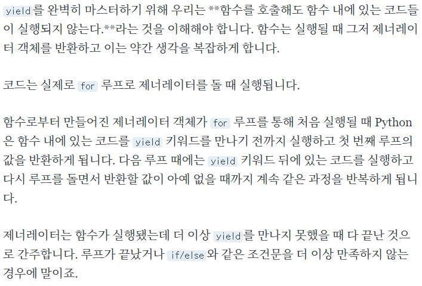  
설명 : yield가 사용된 함수는 제너레이터를 반환한다.    
https://tech.ssut.me/what-does-the-yield-keyword-do-in-python/
예시 : https://github.com/koding1/Coding_test/blob/main/programmers/43163(%EB%8B%A8%EC%96%B4%EB%B3%80%ED%99%98)-bfs%2Cdfs/43163.py

### 19. rjust 
    # "00123"
    "123".rjust(5, "0")
설명 : 문자열의 길이가 첫 번째 인자가 될 때 까지 좌측부터 두 번째 인자(문자)를 삽입한다.    
https://kkamikoon.tistory.com/136
예시 : https://github.com/koding1/Coding_test/blob/main/programmers/17681(%EC%B9%B4%EC%B9%B4%EC%98%A4-%EB%B9%84%EB%B0%80%EC%A7%80%EB%8F%84)-%20%20bit_operation%2C%20rjust%2C%20replace/17681.py

### 19. upper, lower, isupper, islower
    # step 1. 소문자로 변환
    str1 = str1.lower()
설명 : 순서대로 대문자로 변환, 소문자로 변환, 모든 문자열이 대문자인지 체크, 모든 문자열이 소문자인지 체크      
예시 : https://github.com/koding1/Coding_test/blob/main/programmers/17677(%EC%B9%B4%EC%B9%B4%EC%98%A4%20-%20%EB%89%B4%EC%8A%A4%20%ED%81%B4%EB%9F%AC%EC%8A%A4%ED%84%B0%EB%A7%81)-set%2C%20isalpha%2C%20lower/17677.py

### 19. deque - maxlen
    q = deque(maxlen=0)
    print(q)
    # 오류 발생하지 않음
    q.append("city")
    print(q)
설명 : 큐를 특정 길이로 제한, 예시 문항에서 maxlen을 사용하지 않을 시, 20 line에 "q.append(city)" 부분에 캐시 크기가 0 일 때 append 하지 않도록 따로 지정해줘야 한다. 큐를 특정 길이로 제한 해놓는다면 자동으로 append 하지 않게 처리 되기 때문에 많은 경우에 유용하다.
예시 : https://github.com/koding1/Coding_test/blob/main/programmers/17680(%EC%B9%B4%EC%B9%B4%EC%98%A4-%EC%BA%90%EC%8B%9C)-cache%2C%20maxlen%2C%20LRU/17680.py

### 20. set - 교집합, 합집합 표현
    set1 = set([1,2,3,4])
    set2 = set([4,5,6,7])
    print(set1 | set2)
설명 : set 자료형에서 '|' -> 합집합, '&' -> 합집합
예시 : https://github.com/koding1/Coding_test/blob/main/programmers/17679(%EC%B9%B4%EC%B9%B4%EC%98%A4-%ED%94%84%EB%A0%8C%EC%A6%884%EB%B8%94%EB%A1%9D)-idea%2C/17679.py

### 21. sort - key를 사용해서 대소문자 구별 없이 정렬하기
    a = [ "bbb", "AAA", "DDD", "CCC", "aaa" ]
    a.sort(key=str.lower)
    print " ".join(a)
    # 출력 결과: AAA aaa bbb CCC DDD
    
    f = [["BBB", 2], ["ccc", 1], ["bbb", 1], ["BBB", 0]]
    # x[0]을 대소문자 구별없이 먼저 정렬하고, 그 후에 x[1]을 기준으로 정렬
    f.sort(key = lambda x : (x[0].lower(), x[1]))
    # -> x[0].lower() 처럼 사용 할 수도 있다. 
    # [["BBB", 0], ["bbb", 1], ["BBB", 2], ["ccc", 1]]
설명 : sort 함수에서 key = str.lower 를 사용하면 대소문자를 구별하지 않고 정렬 할 수 있다.
예시 : 

### 22. 정규 표현식 두 문장의 차이 '(' 의 유무
    files = ["img1.png", "IMg01.png", "img01.png", "IMG01.png"]
    tmp = [re.split(r"([0-9]+)", s) for s in files]
    # tmp -> [['img', '1', '.png'], ['IMg', '01', '.png'], ['img', '01', '.png'], ['IMG', '01', '.png']]
    tmp = [re.split(r"[0-9]+", s) for s in files]
    # tmp -> [['img', '.png'], ['IMg', '.png'], ['img', '.png'], ['IMG', '.png']]

설명 : sort 함수에서 key = str.lower 를 사용하면 대소문자를 구별하지 않고 정렬 할 수 있다.
예시 : 

### 23. 소수(prime number) 판단하기
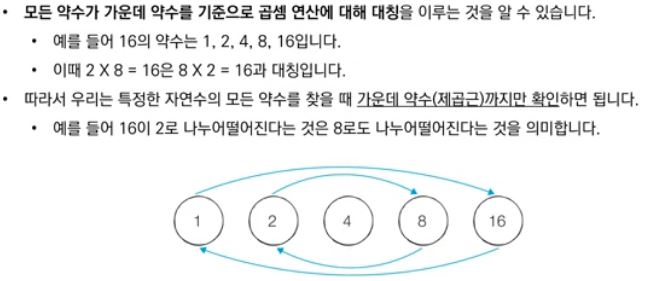     
    
    import math
    # 2부터 x의 제곱근까지만 확인
    for i in range(2, int(math.sqrt(x)) + 1):
        if x % i == 0:
            return False # 소수 아님
    return True # 소수
설명 : 어떤 수 n이 소수인지 확인 할 때 n의 제곱근 까지만 확인하면 된다.    
이 때 시간 복잡도는 O(N**(1/2)) 이다.
예시 : 

### 24-1. 하나의 리스트에서 모든 조합을 구하기 - from itertools import combinations
     
    # combinations(items, 3) -> items 리스트 원소 이루어진 크기가 3인 모든 조합을 구하기
    items = ['1', '2', '3', '4',]
    print(combinations(itmes, 3))
    # [('1', '2', '3'), ('1', '2', '4'), ('2', '3', '4')]
    
설명 : combinations(nums, 3) -> nums 리스트 원소 이루어진 크기가 3인 모든 조합을 구하기    
예시 : https://github.com/koding1/Coding_test/blob/main/programmers/12977(%EC%86%8C%EC%88%98%EB%A7%8C%EB%93%A4%EA%B8%B0)-combinations%2Cis_prime/12977.py

### 24-2. 두개 이상의 리스트에서 모든 조합을 구하기 - from itertools import product     
    
    from itertools import product 
    items = [['1', '2'], ['a', 'b'], ['!', '@']] 
    list(product(*items)) 
    # [('1', 'a', '!'), ('1', 'a', '@'), ('1', 'b', '!'), ('1', 'b', '@'), 
       ('2', 'a', '!'), ('2', 'a', '@'), ('2', 'b', '!'), ('2', 'b', '@')]

출처: https://ourcstory.tistory.com/414 [불로]  
설명 : combinations(nums, 3) -> nums 리스트 원소 이루어진 크기가 3인 모든 조합을 구하기    
예시 : https://github.com/koding1/Coding_test/blob/main/programmers/12977(%EC%86%8C%EC%88%98%EB%A7%8C%EB%93%A4%EA%B8%B0)-combinations%2Cis_prime/12977.py

### 25-1. gcd(최대공약수) 구하기  
    # 1.
    def gcd(x, y):
        # y가 0이 될 때 까지
        while y:
            # y를 x에 대입
            # x를 y로 나눈 나머지를 y에 대대입
            x, y = y, x % y
        return x
    # 2.
    import math
    # x, y, z 의 최대공약수
    print(math.gcd(x,y,z))
예시 : https://github.com/koding1/Coding_test/blob/main/BJ/solvedac/class2/2609(%EC%B5%9C%EB%8C%80%EA%B3%B5%EC%95%BD%EC%88%98%EC%99%80%20%EC%B5%9C%EC%86%8C%EA%B3%B5%EB%B0%B0%EC%88%98)%20-%20gcd%2C%20lcm      
### 25-2. lcm(최소공약수) 구하기  
    # 1.
    def lcm(x, y):
        return x * y // gcd(x,y)
    # 2.
    import math
    # x, y의 최소공배수
    print(math.lcm(x,y))
예시 : https://github.com/koding1/Coding_test/blob/main/BJ/solvedac/class2/2609(%EC%B5%9C%EB%8C%80%EA%B3%B5%EC%95%BD%EC%88%98%EC%99%80%20%EC%B5%9C%EC%86%8C%EA%B3%B5%EB%B0%B0%EC%88%98)%20-%20gcd%2C%20lcm      
### 26. heapq 라이브러리 - 최소 힙 자료구조
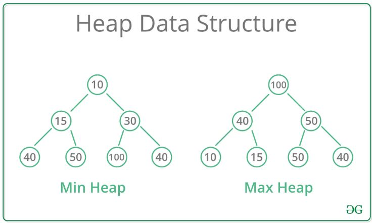
    
    import heaqp
    
    #힙 불변성을 유지하면서, item 값을 heap으로 푸시합니다.
    heapq.heappush(heap, item)

    # heqp에서 가장 작은 항목을 pop하고 반환 (힙 불변성 유지)
    heapq.heappop(heap)
    
    # 리스트 x를 선형 시간으로 제자리에서 힙으로 변환합니다.
    heapq.heapify(x)  
    
설명 : heapq 라이브러리를 사용한 최소 힙 자료구조 구현 ( 최대 힙은 출처 첫 번째 링크 참조 ) 
예시 : https://github.com/koding1/Coding_test/blob/main/programmers/42626(%EB%8D%94%EB%A7%B5%EA%B2%8C)-min_heap/42626.py      
출처 및 참조 :       
https://littlefoxdiary.tistory.com/3      
https://docs.python.org/ko/3/library/heapq.html         

### 27. 이분 탐색( == 이진 탐색) - Binary search
    
    while start <= end:
        # 이번 차례 검사할 시간(분)
        mid = (start + end)//2
        immigration_count = 0
        
        # 조건 : 모든 인원이 해당 시간에 검사를 받을 수 있는지
        # 조건에 대한 판단은 sum(mid // 심사에 걸리는 시간)과 n을 검사
        # mid // 심사 시간 은 해당 검사관이 mid분에 검사 할 수 있는 최대 인원을 의탐색의
        
        immigration_count = sum([(mid//i) for i in times])
        
        # 해당 시간(mid분) 내에 n명을 모두 검사 할 수 있다면 (시간을 mid 이하로 줄일 수 있음)
        if immigration_count >= n: # 왼쪽으로 범위 축소
            end = mid - 1
            minimum_time = mid
        else: # 오른쪽으로 범위 축소
            start = mid + 1
    
설명 : 이진 탐색 구현

예시 :
[43238 문제](https://programmers.co.kr/learn/courses/30/lessons/43238)      
[43238 코드](https://github.com/koding1/Coding_test/blob/main/programmers/43238(%EC%9E%85%EA%B5%AD%EC%8B%AC%EC%82%AC)-%EC%9D%B4%EB%B6%84%ED%83%90%EC%83%89%2C%ED%8C%8C%EB%9D%BC%EB%A9%94%ED%8A%B8%EB%A6%AD%EC%84%9C%EC%B9%98/43238.py)    
출처 및 참조 :       
https://sanghyeok.tistory.com/7

### 28. 병합(합병) 정렬(Merge sort) 구현

    def merge_sort(array):
        # 종료 조건
        if len(array) == 1:
            return array

        mid = (0 + len(array)) // 2
        left = merge_sort(array[:mid])
        right = merge_sort(array[mid:])

        i = 0
        j = 0
        k = 0

        while True:
            if left[i] <= right[j]:
                array[k] = left[i]
                k += 1
                i += 1
            else:
                array[k] = right[j]
                k += 1
                j += 1

            if i >= len(left): # left 는 모두 삽입
                while j < len(right): # 남은 right 삽입
                    array[k] = right[j]
                    k += 1
                    j += 1
                break
            if j >= len(right): # right 는 모두 삽입
                while i < len(left): # 남은 left 삽입
                    array[k] = left[i]
                    k += 1
                    i += 1
                break

        return array
설명 : 병합 정렬(Merge sort)
예시 : https://github.com/koding1/Coding_test/blob/main/programmers/BJ/sort/2751.py     
출처 및 참조 :       
https://ko.wikipedia.org/wiki/%ED%95%A9%EB%B3%91_%EC%A0%95%EB%A0%AC       
https://assaeunji.github.io/python/2020-05-06-bj2751/

### 29. 역 슬라이싱

    for item in my_list[::-1]: #[::-1] 역으로 슬라이싱
    
설명 : my_list 안의 원소를 my_list[-1] 부터 my_list[0] 까지 슬라이싱한다.  

### 30. 다중 조건 정렬

    strs.sort(key = lambda x : (len(x), x)) # 기준 1 -> 문자열 길이, 기준 2 -> 문자열
    
설명 : 문자열 길이로 정렬하고, 문자열 길이가 같은 것 끼리 문자열 아스키 기준으로 정렬        
예시 : https://github.com/koding1/Coding_test/blob/main/BJ/solvedac/class2/1181(%EB%8B%A8%EC%96%B4%EC%A0%95%EB%A0%AC)%20-%20%EB%8B%A4%EC%A4%91%EC%A0%95%EB%A0%AC      

### 31. 입력 빠르게 받기

    1. strs.append(sys.stdin.readline().strip())
    
    2. strs.append(input())
    
설명 : 1번이 2번보다 훨씬 빠르다       
예시 : https://github.com/koding1/Coding_test/blob/main/BJ/solvedac/class2/1181(%EB%8B%A8%EC%96%B4%EC%A0%95%EB%A0%AC)%20-%20%EB%8B%A4%EC%A4%91%EC%A0%95%EB%A0%AC       

   

## 기억하고 싶은 문제  
### 1. 1697 메모이제이션 + BFS
설명 : 해당 문제는 아이디어부터, 기초적인 메모이제이션 기법을 사용했기 때문에 차후 복습하고 싶다.    
예시 : [1697](https://github.com/koding1/BOJ/tree/main/1697-(BFS)%E2%98%85)

### 2. 12973 짝지어 제거하기 (slice vs pop) by programmers
설명 : 해당 문제에서, 분명 처음 코드도 O(n) 만큼 반복문을 수행하는데 Stack을 사용한 코드와 시간 차이가 많이 나서 의아했었다.    
이에 궁금증이 생겨 알아보니, slice와 pop 사이의 성능 차이(속도)로 인해 발생한 문제인 것 같다.      
예시 : [12973](https://github.com/koding1/Coding_test/blob/main/programmers/12973(%EC%A7%9D%EC%A0%9C%EA%B1%B0)-stack/12973.py)

### 3. 43165 타겟 넘버 (BFS, DFS, unpacking, itertools.product(데카르트곱)) by programmers
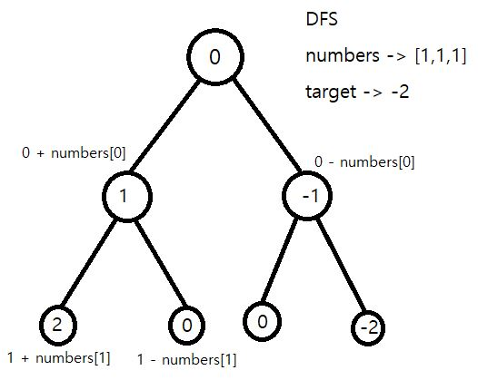    

설명 : BFS, DFS 의 동작과 더불어 인상적인 코드(2) 에서 unpacking, itertools.product 를 잘 활용했다.   
BFS, DFS의 이론을 알지만 문제에서의 활용이 헷갈릴 때 참고하면 좋은 문제이다.     
예시 :
[43165 문제](https://programmers.co.kr/learn/courses/30/lessons/43165)
[43165 코드](https://github.com/koding1/Coding_test/blob/main/programmers/43165(%ED%83%80%EA%B2%9F%EB%84%98%EB%B2%84)-bfs,dfs/43165.py)

### 4. 17676 카카오 추석 트래픽 (문자열 처리, 슬라이딩 윈도우, 아이디어) by programmers
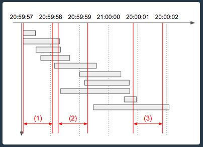    

설명 : 요청량이 변하는 순간은 각 로그의 시작과 끝 이라는 점을 떠올리는게 중요한 문제이다. 이 아이디어로 O(n^2) 의 복잡도로 해결 할 수 있고, 이는 혼자 구현 할 수 있었다.
O(nlogn)의 알고리즘이 있는데, 아직 완전히 이해하지 못했다. 따라서 추후에 마저 공부하고 싶은 문제이다.
예시 :
[17676 문제](https://programmers.co.kr/learn/courses/30/lessons/17676)
[17676 코드](https://github.com/koding1/Coding_test/blob/main/programmers/17676(%EC%B9%B4%EC%B9%B4%EC%98%A4-%EC%B6%94%EC%84%9D%ED%8A%B8%EB%9E%98%ED%94%BD)/17676.py)

### 5. 17681 카카오 비밀 지도 (비트 연산자, rjust) by programmers
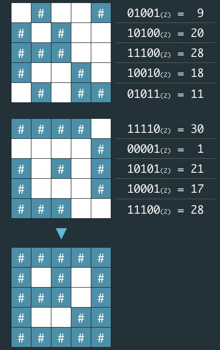    

설명 : bit 연산자(이 문제에서는 '|' )를 사용하는게 핵심인 문제이다. 또한 rjust 를 처음 사용하게 된 문제여서 기억하고 싶다. 아이디어를 떠올리는 난이도는 어렵지 않았다.
예시 :
[17681 문제](https://programmers.co.kr/learn/courses/30/lessons/17681?language=python3)
[17681 코드](https://github.com/koding1/Coding_test/blob/main/programmers/17681(%EC%B9%B4%EC%B9%B4%EC%98%A4-%EB%B9%84%EB%B0%80%EC%A7%80%EB%8F%84)-%20%20bit_operation%2C%20rjust%2C%20replace/17681.py)

### 6. 17680 카카오 캐시 (cache(LRU), maxlen) by programmers
설명 : LRU 방식의 캐시 알고리즘에 대한 참고 및 deque 객체에 maxlen을 사용한 문제이다.
예시 :
[17681 문제](https://programmers.co.kr/learn/courses/30/lessons/17680)      
[17681 코드](https://github.com/koding1/Coding_test/blob/main/programmers/17680(%EC%B9%B4%EC%B9%B4%EC%98%A4-%EC%BA%90%EC%8B%9C)-cache%2C%20maxlen%2C%20LRU/17680.py)

### 6. 17679 카카오 프렌즈4블록 (set를 이용한 합집합, idea, enumerate) by programmers
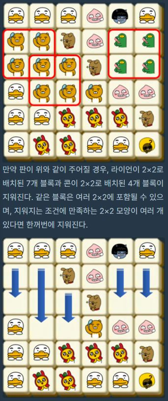 
설명 : 코드 링크에 아래 쪽 '효율적인 코드' 를 보면 된다.    
set를 이용하여 간단하게 합집합을 구현하고, enumerate를 잘 활용했다.   
인상적인 것은 블록 제거 후 재구성을 편리하게 하기 위해 행과 열을 서로 치환하여 문제를 진행한다는 아이디어이다.    
예시 :
[17679 문제](https://programmers.co.kr/learn/courses/30/lessons/17679)      
[17679 코드](https://github.com/koding1/Coding_test/blob/main/programmers/17679(%EC%B9%B4%EC%B9%B4%EC%98%A4-%ED%94%84%EB%A0%8C%EC%A6%884%EB%B8%94%EB%A1%9D)-idea%2C/17679.py)

### 7. 43238 입국심사 (이분 탐색(Binaray search), 파라메트릭 서치(Parametric search) by programmers

설명 : 이분 탐색을 깔끔하게 다룬 문제라서 기억하고 싶다.    
제한 사항(심사 시간 : 1분 ~ 1,000,000,000분)을 보고 이진 탐색이라는 키워드를 떠올려야 한다.   

파라메트릭 서치 (Parametric search) : 최적화 문제를 결정 문제(예, 아니오로 답하는 문제)로 바꾸어 해결하는 기법. '원하는 조건을 만족하는 가장 알맞은 값을 찾는 문제'       

예시 :
[43238 문제](https://programmers.co.kr/learn/courses/30/lessons/42578)
[43238 코드](https://github.com/koding1/Coding_test/blob/main/programmers/43238(%EC%9E%85%EA%B5%AD%EC%8B%AC%EC%82%AC)-%EC%9D%B4%EB%B6%84%ED%83%90%EC%83%89%2C%ED%8C%8C%EB%9D%BC%EB%A9%94%ED%8A%B8%EB%A6%AD%EC%84%9C%EC%B9%98/43238.py)    
참조 : https://sanghyeok.tistory.com/7

### 8. 42578 위장 (해시, mathematical idea) by programmers

설명 : 단순한 경우의 수 곱하기 문제인데, 수학적 아이디어를 떠올리기가 쉽지 않았다.

    if item[1] not in d:
        # 1로 시작하는 이유 : 해당 부위를 입지 않을 경우를 추가하기 위해서
        d[item[1]] = 1
        
    d[item[1]] += 1

해당 부분이 핵심인데,  
'나이키볼캡' 을 착용하는 경우, '버킷햇'을 착용하는 경우 -> 2가지 에,     
'모자를 착용하지 않은 경우' -> 1가지 도 고려해야 하기 때문에     
모자에 '나이키볼캡', '버킷햇' 과 같이 아이템 2개가 들어 왔을 때, d['모자'] = 3 가 되도록 한다.  

    for num in list(d.values()):
            answer *= num

이후 모자 수 * 상의 수 * 하의 수 (KEY 에 모자, 상의, 하의가 들어 왔을 때에 대한 예시이다) 와 같이 계산해준다.
위에 설명한 것 처럼, 모자 수, 상의 수, 하의 수는 실제로 주어진 것보다 각각 1씩 크다.    
모자를 입지 않은 경우, 상의를 입지 않은 경우, 하의를 입지 않는 경우가 더해졌기 때문이다.    

    return answer-1
    
하지만 문제 설명에서 최소 1 개의 옷은 입어야한다고 했으므로, answer - 1 을 하여    
아무것도 입지 않은 경우에 대한 count를 제거해준다.    

예시 :
[42578 문제](https://programmers.co.kr/learn/courses/30/lessons/43238) 
[42578 코드](https://github.com/koding1/Coding_test/blob/main/programmers/%E2%98%8542578(%EC%9C%84%EC%9E%A5)-%ED%95%B4%EC%8B%9C%2C%EC%88%98%ED%95%99%EC%A0%81%EC%95%84%EC%9D%B4%EB%94%94%EC%96%B4/42578.py)    

### 9. 42584 주식가격 (Stack, idea) by programmers

설명 : 해당 문제를 스택으로 해결하는 아이디어를 떠올리기 쉽지 않았다.

기본적인 아이디어는
1. 스택의 가장 top 원소는 스택 내에 있는 원소 중 가장 높은 가격을 가졌던 시간이 되도록 유지한다.
2. 새로운 시간이 stack에 들어올 때, 1번 규칙이 지켜지도록 해야하므로 새로 들어올 시간의 가격이 top 시간의 가격보다 높으면 그대로 삽입하고, 그렇지 않다면 top을 pop 함과 동시에 top 시간대의 answer를 결정한다.
3. 이 때 top 시간대의 answer는 새로 들어올 시간 - top 시간 이다.

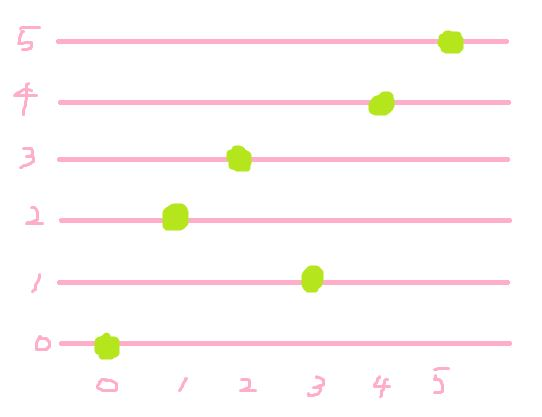      
위의 사진은 5초간의 주식 가격 변화를 표현한 그림이다.     

Step 1.           
Stack을 초기화 한다. 이 때 0은 0초를 의미한다.     
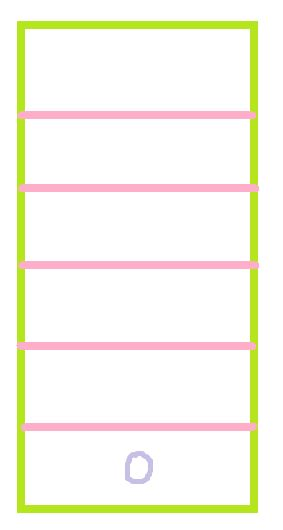     

Step 2.      
top second는 0, top price는 0초 일 때 가격, 즉 0이다. now second는 1이며, now price 는 2이다.    
now price(2)가 top price(0) 보다 크므로 1번 기준에 따라 Stack에 now second(1) 을 삽입한다.      
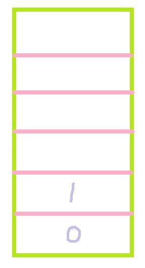     

Step 3.      
top second는 1, top price는 1초 일 때 가격, 즉 2이다. now second는 2이며, now price 는 3이다.    
now price(3)가 top price(2) 보다 크므로 1번 기준에 따라 Stack에 now second(2) 을 삽입한다.     
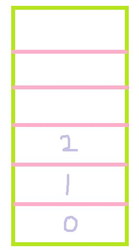     

Step 4.      
now second는 3이고 now price는 1이다. 1번 기준을 만족 시키면서 3을 삽입 해야 하므로, now price(1) 보다 큰 price를 가지고 있는 second는 제거된다.   
1번 순서에서 top second(2) 일 때의 가격 3과 now price(1)을 비교하고, now price보다 높으므로 stack pop이 이뤄진다.   
이 때, top second, 즉 2초 의 answer는 now second - top second = 3 - 2 = 1 이 된다.      
2번 순서에서 top second(1) 일 때의 가격 2와 now price(1)을 비교하고, now price보다 높으므로 stack pop이 이뤄진다.    이 때, top second, 즉 1초 의 answer는 now second - top second = 3 - 1 = 2 이 된다.      
3번 순서에서 now price(1)이 top price(0)보다 높으므로, now second 3이 삽입된다.  
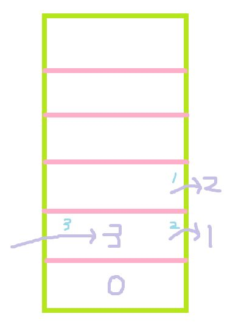     

Step 5.     
top second는 3, top price는 3초 일 때 가격, 즉 1이다. now second는 4이며, now price 는 4이다.    
now price(4)가 top price(1) 보다 크므로 1번 기준에 따라 Stack에 now second(4) 을 삽입한다.     
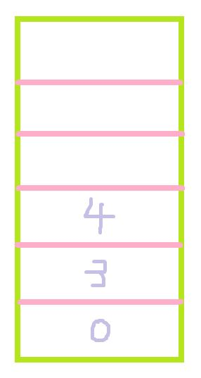  

Step 6.      
top second는 4, top price는 4초 일 때 가격, 즉 4이다. now second는 5이며, now price 는 5이다.    
now price(5)가 top price(4) 보다 크므로 1번 기준에 따라 Stack에 now second(5) 을 삽입한다.     
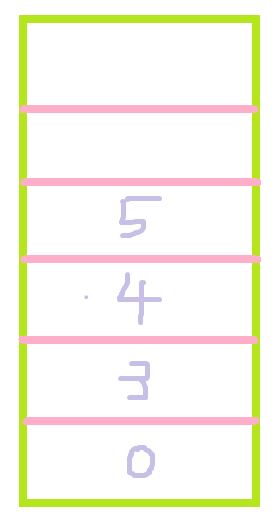  

Step 7.      
Stack 내의 남은 원소들이 남아있다. (5, 4, 3, 0)
5초 answer -> 5 - 5      
4초 answer -> 5 - 4      
3초 answer -> 5 - 3      
0초 answer -> 5 - 0     
Stack 남이 있는 second 들은 하락을 경험한 적 없는 시간이므로, '끝 시간(5) - 해당 시간' 을 통해 얼마 동안 상승장을 유지했는지 구할 수 있다.
answer 1, 2는 Step 4에서 각각 2, 1 로 정해졌다.     

최종 답은 5 2 1 2 1 0 이 된다.   

예시 :
[42584 문제](https://programmers.co.kr/learn/courses/30/lessons/42584) 
[42584 코드](https://github.com/koding1/Coding_test/blob/main/programmers/%E2%98%8542584(%EC%A3%BC%EC%8B%9D%EA%B0%80%EA%B2%A9)-%EC%8A%A4%ED%83%9D%2C%EC%95%84%EC%9D%B4%EB%94%94%EC%96%B4/42584.py)    

### 10. 42839 소수 찾기 (Prime number, ) by programmers

설명 : 순열이란 n개의 값 중에서 r개의 숫자를 모든 순서대로 뽑는 경우를 말한다. 수열에서 순서에 따라 결과가 달라지는 방식이다.    
참조 링크에 2번 Visited 를 이용해 DFS로 구현하는 방법을 사용해보았다. 조합(Combination)과 순열(Permutation)에 약한 것 같아 연습이 필요하다고 느낀다.    

    if visited[i] == False:

        tmp = output.copy()
        tmp.append(numbers[i])

        tmp_visited = visited.copy()
        tmp_visited[i] = True
        
        per1(arr, tmp, numbers, tmp_visited, depth+1, finish)

재귀 호출 부분만 살펴보면, output.copy()를 사용해서 output이 손상되는 일이 없도록 설계했고, visited 도 tmp_visited 를 이용했다.     
메모리 효율성이 좋지 않으므로, 더 나은 방식에 대한 고민이 필요 할 것 같다. https://ykss.netlify.app/algorithm/reetcode_8/

    # set의 특성을 유지하면서 list를 set에 추가 할 수 있음
    my_set.update(arr)

set 자료형 함수들도 상기 시킬 필요가 있어 가져와보았다.

    def isprime(num):

        for i in range(2, int(math.sqrt(num)) + 1):
            if num % i == 0:
                return False

        return True
 
Prime num 판별은 자주 사용하는 코드 중에 하나다. 2부터 int(math.sqrt(num)) + 1 까지만 체크하면 해당 수가 소수인지 아닌지 판별 할 수 있다.    
'에라토스테네스의 체'라는 방식으로 푼 코드들도 있었는데, 알아두면 좋을 것 같아서 링크한다.     
[에라토스테네스의 체 위키백과](https://ko.wikipedia.org/wiki/%EC%97%90%EB%9D%BC%ED%86%A0%EC%8A%A4%ED%85%8C%EB%84%A4%EC%8A%A4%EC%9D%98_%EC%B2%B4) 
     
예시 :
[42839 문제](https://programmers.co.kr/learn/courses/30/lessons/42839?language=python3) 
[42839 코드](
https://github.com/koding1/Coding_test/blob/main/programmers/%E2%98%8542839(%EC%86%8C%EC%88%98%EC%B0%BE%EA%B8%B0)-%EC%86%8C%EC%88%98%2C%EC%88%9C%EC%97%B4%2Cset%2CPermutation/42839.py)      
참조 : https://minhamina.tistory.com/37

### 11. 49189 가장 먼 노드 (Graph, BFS) by programmers

설명 : Graph 구현과 BFS가 잘 활용된 문제이다.     
이 문제에서 기억하고 싶은 부분은 "BFS가 최단 거리를 보장한다는 점" 이다.     

    # i 정점에 방문 한 적 없다면
    if visited[i] == False:
        q.append(i) # i 정점 삽입
        visited[i] = True
        distance[i] = distance[now] + 1

distance를 수정 할 때,    

    if distance[i] > distance[now] + 1:
        distance[i] = distance[now] + 1

처럼 굳이 if 문을 사용하여 '기존에 확인 되었던 i 까지의 거리'와 '이번 경로의 거리'를 비교하지 않았다는 것을 확인 할 수 있다.    
이는 해당 정점에 처음 방문하기만 했다면, '항상 최단 거리로 도달 했다'는 점이 보장되기 때문에 가능한 일이다.    

예시 :
[49189 문제](https://programmers.co.kr/learn/courses/30/lessons/49189)
[49189 코드](
https://github.com/koding1/Coding_test/blob/main/programmers/%E2%98%8549189(%EA%B0%80%EC%9E%A5%EB%A8%BC%EB%85%B8%EB%93%9C)-Graph%2CBFS/49189.py)

# 미해결 :    
1. match 결과에 차이가 발생하는 이유    

        st = '103D'
        # 1. <_sre.SRE_Match object; span=(0, 1), match='1'>
        print(re.match('[\d+]', st))
        # 2. <_sre.SRE_Match object; span=(0, 3), match='103'>
        print(re.match('\d+', st))
해결 : '[\d+]' 은 '숫자 여러 개 반복' 이 아니라 숫자 or '+' 이다. '\d+'나, '[\d]+' 로 쓰는 것이 옳다.

2. 정규 표현식 두 문장의 차이 '(' 의 유무     

        files = ["img1.png", "IMg01.png", "img01.png", "IMG01.png"]
        tmp = [re.split(r"([0-9]+)", s) for s in files]
        # tmp -> [['img', '1', '.png'], ['IMg', '01', '.png'], ['img', '01', '.png'], ['IMG', '01', '.png']]
        tmp = [re.split(r"[0-9]+", s) for s in files]
        # tmp -> [['img', '.png'], ['IMg', '.png'], ['img', '.png'], ['IMG', '.png']]
해결 : 그냥 그런가보다.. ㅠ 어떤 원리인지 잘 이해 안감
        
3. 멀쩡한 사각형 - gcd, idea
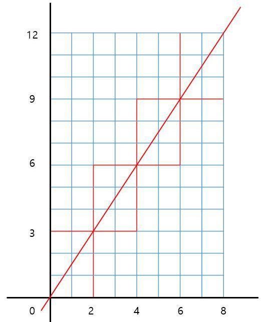      
빨간 네모가 총 4번 반복 된다. 이 때 '4' 는 8과 12의 gcd(최대공약수) 이다.
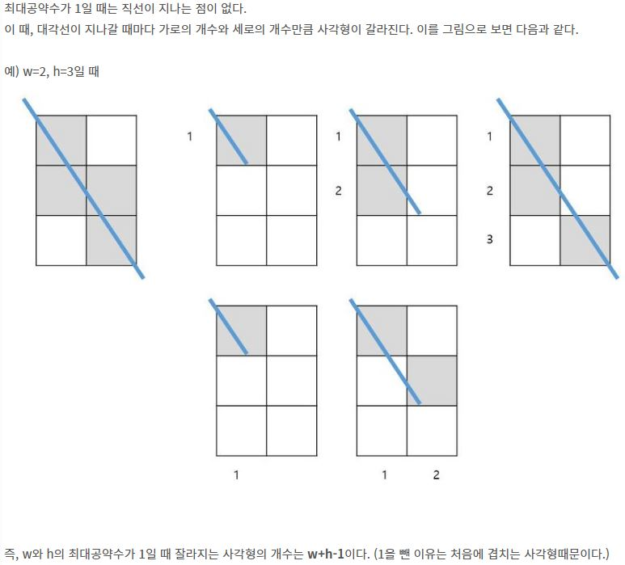      
또한, 한 네모 안에서 사용 할 수 없게되는 단위 사각형의 수는 가로 + 세로 - 1 이다.     
1을 빼는 이유는 겹치는 사각형 때문이다.     

아이디어가 진짜 어려웠던 문제..     
아직 대각선이 지나갈 때 가로와 세로 길이 만큼 사각형이 잘린다는 것이 잘 이해가 가지 않는다.     
코드 : https://github.com/koding1/Coding_test/blob/main/programmers/%E2%98%8562048(%EB%A9%80%EC%A9%A1%ED%95%9C%EC%82%AC%EA%B0%81%ED%98%95)-gcd%2Cidea/62048.py      
설명 : https://leedakyeong.tistory.com/entry/%ED%94%84%EB%A1%9C%EA%B7%B8%EB%9E%98%EB%A8%B8%EC%8A%A4-%EB%A9%80%EC%A9%A1%ED%95%9C-%EC%82%AC%EA%B0%81%ED%98%95-in-python

# 참조 사이트

https://chloeelog.notion.site/KAKAO-BLIND-3-21c9ac7180d14874a5c7ba6848da305e
